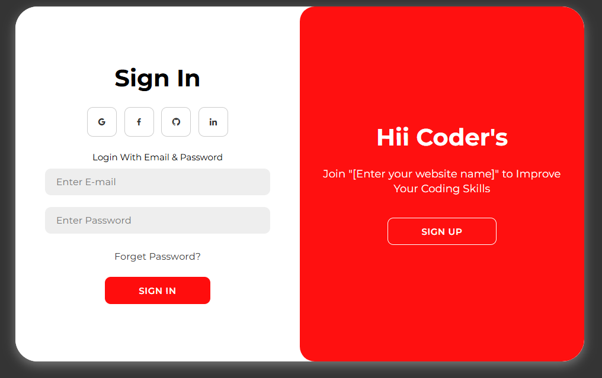

# 🔐 Login & Register Page

A modern, responsive *Login & Registration UI* built using *HTML*, *CSS*, and *JavaScript*. It includes animated transitions and social login icons for a professional user experience.

## 🚀 Features

- Smooth toggle animation between *Sign In* and *Sign Up*
- Clean, responsive design
- Social media login buttons (Google, Facebook, GitHub, LinkedIn)
- Easy to customize and integrate
- Pure HTML, CSS, and JavaScript (no frameworks)

## 🖥 Live Preview

> 📌

## ⚙ How to Use

1. *Clone this repository* 
   ```bash
   git clone https://github.com/akash098p/Login-Registration-Page.git
   cd Login-Registration-page
   index.html

2. *Open index.html in your browser*
   ```bash
   # you can double-click the file or use Livr Server (VS Code)

## 🧩Customization Tips
  Replace [Enter your website name] in the HTML with your actual site or app name.
  
  Customize fonts, colors, and spacing via style.css.
